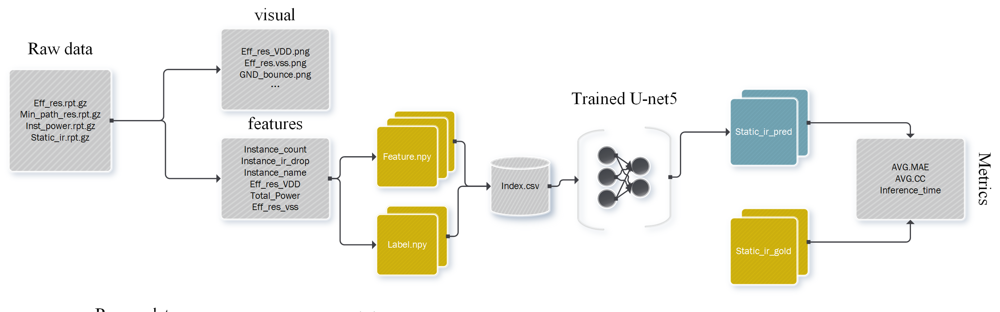

<div align="center">
 
</div>

---
# 基于SoC静态压降大数据的预测系统
SoC Analyser是一个拥有高性能的SoC静态压降大数据分析系统。它可以根据一张芯片特征图，精准地预测芯片各个位置的电压降。这对于大规模集成电路的设计具有重要意义。
<div align="center">
 
</div>


SoC Analyser能够在5种主流芯片设计的静态压降预测任务中获得0.0008平均误差及92%相关系数，并且拥有比静态分析工具更快的运行速度。

你可以通过以下步骤复现我们的实验。

---


## :sunny:操作指南
请按照下述操作指南进行系统的搭建和运行。
### 硬件环境
Linux系统，虚拟机型号Ubuntu 18.04及以上。同时含至少8G显存,CUDA驱动版本11.8及以上。
### 数据获取
你可以从[百度网盘](https://pan.baidu.com/s/1Uz7mPTMExlROH5i5W4sN2Q?pwd=8xa8)下载数据。具体而言，进入网址后，下载所有的tar.gz文件，并且放入同一个目录`dataset`之下。
使用如下命令解压所有的文件：
```shell
cd dataset
for file in *.tar.gz; do tar -xzvf "$file"; done
```
### 环境搭建和模型部署
执行下列命令，将自动进行系统的搭建、部署和测试。
```shell
bash setup_and_run_socanalyzer.sh
```
最终得到的执行情况类似下图所示。

## :moon:项目内容
项目代码已经上传至Github，访问[此链接](https://github.com/HeartyHaven/soc-analyser)以查看原始开源项目。