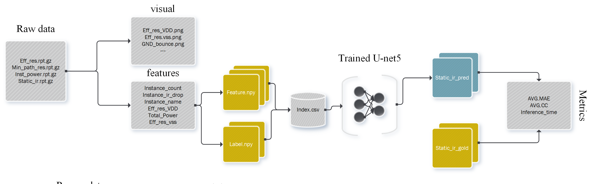

<div align="center">
 
</div>

---
# 基于SoC静态压降大数据的预测系统
SoC Analyser是一个拥有高性能的SoC静态压降大数据分析系统。它可以根据一张芯片特征图，精准地预测芯片各个位置的电压降。这对于大规模集成电路的设计具有重要意义。
<div align="center">
 
</div>

<center>SoC Analyzer 工作流程</center>


SoC Analyser能够在5种主流芯片设计的静态压降预测任务中获得0.0008平均误差及92%相关系数，并且拥有比静态分析工具更快的运行速度。

你可以通过以下步骤复现我们的实验。

---


## :sunny:环境配置
1. 进入项目目录
```shell
git clone https://github.com/HeartyHaven/soc-Analyzer
cd soc-Analyzer
```
2. 安装依赖：创建环境
```shell
conda create -n soc_analyser python==3.9.16
conda activate soc_analyser
pip install --upgrade pip # enable PEP 660 support
```
3. 安装依赖
```shell
pip install -r requirements.txt
```
## :rocket:数据获取
我们使用行芯EMIR分析工具GloryBolt对集成电路网表的抽取结果进行静态压降分析。我们提供了一个拥有7322条网表抽取结果的数据集，你可以通过[百度网盘](https://pan.baidu.com/s/1Uz7mPTMExlROH5i5W4sN2Q?pwd=8xa8)下载:请下载所有的tar.gz文件并且将所有下载内容保存在同一个文件夹dataset中。

下载完毕后，执行
```shell
cd dataset
for file in *.tar.gz; do tar -xzvf "$file"; done
```

## :hourglass:数据预处理
#### 输入数据
下载数据后，请将输入数据按照如下格式存放：
```yaml
-data
| - nvdla-small_freq_200_mp_1_
|  |- eff_res.rpt.gz
|  |- min_path_res.rpt.gz
|  |- power.rpt.gz
| - nvdla-small_freq_200_mp_2_
| - nvdla-small_freq_200_mp_3_
 ...
```
然后执行以下命令
```shell
python feature_extraction/process_data.py \
--data_root path/to/your/data
```

这将从你的数据中提取关键信息，并且以数组的形式保存在本地。
#### 数据集生成

```shell
python feature_extraction/generate_training_set.py 
```
#### 生成索引

```shell
python feature_extraction/generate_csv.py 
```
这将生成索引文件`train.csv`,`test.csv`.
## :star:模型训练

本项目提供预训练模型参数`model.pth`，可直接用于测试。

**从头训练：** 使用`batch_size`=1170，在8*RTX 4090设备上进行训练约12小时以获得SoC Analyser模型。我们观察到参数`batch_size`与训练效果呈正相关。所以降低`batch_size`可能导致性能下降。

训练前，请在`args/train.json`中修改参数`save_path`、`ann_file`、`data_root`为结果保存路径、`train.csv`路径以及抽取的特征文件所在路径。

如果想用预训练参数初始化模型，请定义参数`pretrained`.
```shell
python model_training/train.py --args model_training/args/train.json
```

## :black_nib:模型预测与效果评估
预测前，请在`model_training/args/test.json`中修改参数`save_path`、`ann_file`、`data_root`为结果保存路径、`test.csv`路径以及抽取的特征文件所在路径。
```shell
python model_training/test.py --args model_training/args/test.json --pretrained path/to/your/model.pth
```
程序将输出详细的模型评估信息，包括在不同设计上的平均绝对误差与相关系数。你将在`save_path`路径下获取样本的电压降分布。
## :moon: 致谢
本项目代码的实现参考了[CircuitNet](https://github.com/circuitnet/CircuitNet)和[IREDGe](https://github.com/VidyaChhabria/ThermEDGe-and-IREDGe.git)项目的实现，我们对此卓越的工作表示诚挚感谢！
